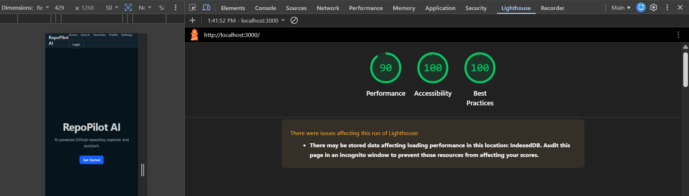
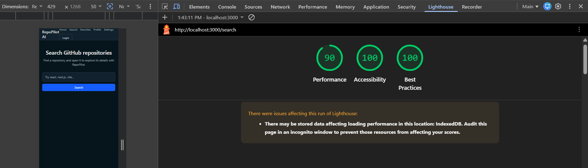
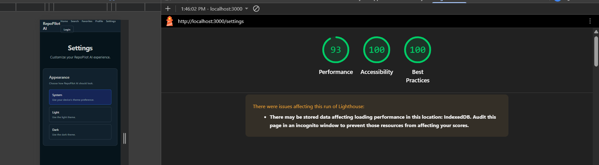
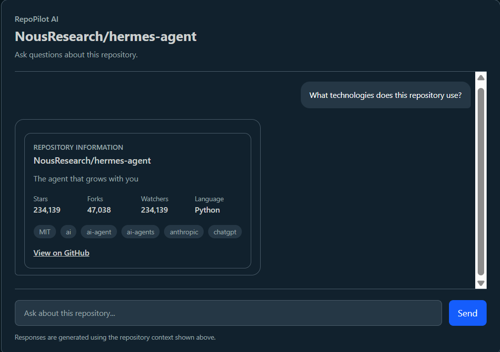
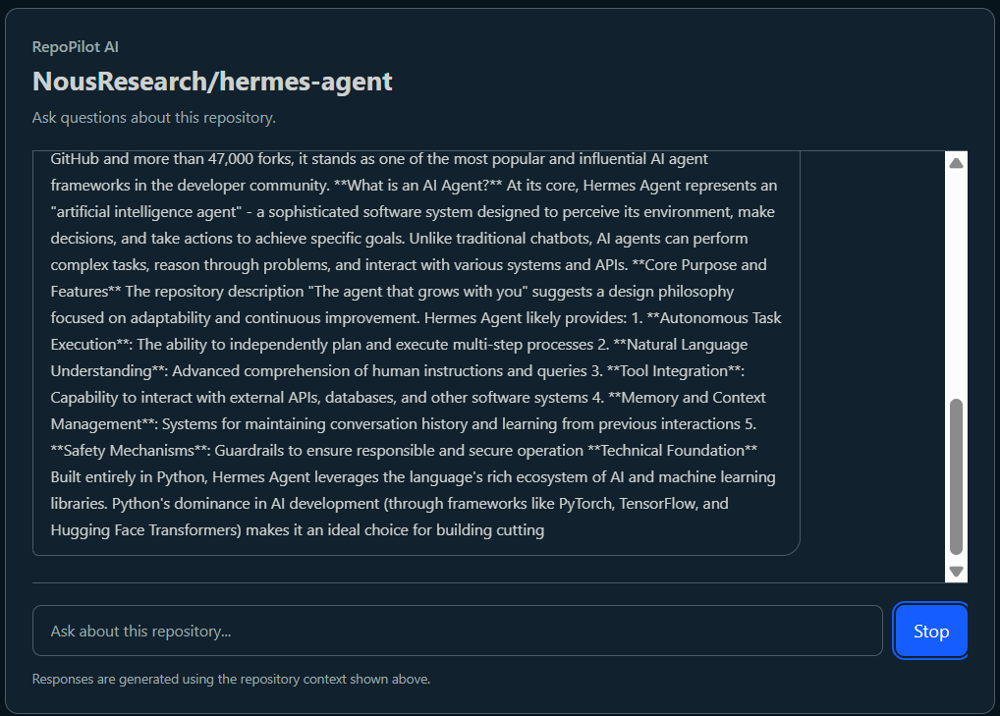
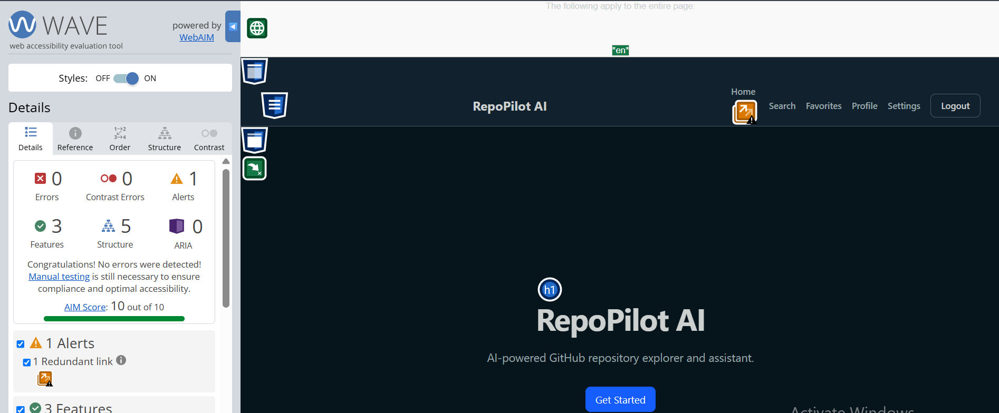
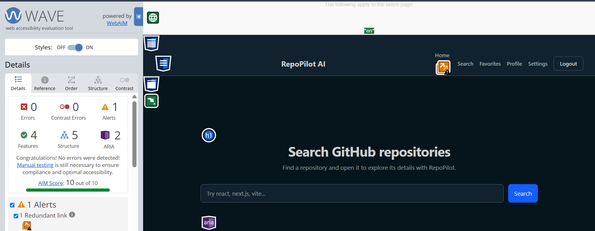
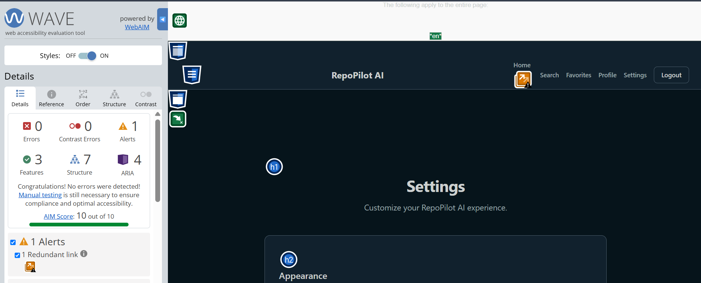

# FE-10 — Accessibility and Performance Audit

## 1. Audit Overview

This audit was completed for FE-10 to evaluate the application's mobile performance and accessibility.

The audit covered:

* Home page
* Search page
* Settings page
* AI Assistant
* WAVE accessibility evaluation
* Keyboard-only navigation
* Lighthouse Mobile performance
* Lighthouse accessibility
* Lighthouse best practices

The Lighthouse audits were performed using the **Mobile** preset.

---

# 2. Lighthouse Mobile Audit

The application was audited using Lighthouse's Mobile preset.

The audited pages achieved the following results:

| Page     | Performance | Accessibility | Best Practices |
| -------- | ----------: | ------------: | -------------: |
| Home     |          90 |           100 |            100 |
| Search   |          90 |           100 |            100 |
| Settings |          93 |           100 |            100 |

All three pages meet the FE-10 target of 90+ for Performance and Accessibility.

## Home Page

* Performance: **90**
* Accessibility: **100**
* Best Practices: **100**



## Search Page

* Performance: **90**
* Accessibility: **100**
* Best Practices: **100**



## Settings Page

* Performance: **93**
* Accessibility: **100**
* Best Practices: **100**



### Lighthouse Summary

The final Lighthouse results were:

* **Home:** 90 Performance, 100 Accessibility, 100 Best Practices
* **Search:** 90 Performance, 100 Accessibility, 100 Best Practices
* **Settings:** 93 Performance, 100 Accessibility, 100 Best Practices

The FE-10 requirement is satisfied because all audited pages achieved at least 90 for Performance and Accessibility.

---

# 3. Accessibility Improvements

The accessibility work focused on semantic structure, keyboard navigation, visible focus states, accessible names, loading states, decorative content, and AI-specific accessibility.

## 3.1 Skip to Main Content

A **Skip to main content** link was added to the application layout.

The link is visually hidden until it receives keyboard focus and allows keyboard users to skip the repeated navigation and move directly to the main content.

The main content area has a dedicated `id="main-content"` target.

### Keyboard Verification

The following test was performed:

1. Refresh the page.
2. Press `Tab`.
3. Confirm **Skip to main content** appears.
4. Press `Enter`.
5. Confirm focus moves to the main content.

**Result: Passed.**

---

## 3.2 Keyboard Focus Visibility

Visible keyboard focus styles were added to interactive elements throughout the application.

This includes:

* Navigation links
* Login/logout controls
* Buttons
* Other keyboard-interactive elements

The `focus-visible` styles make it clear which interactive element currently has keyboard focus.

### Verification

After activating the skip link, `Tab` was used to move through the interactive elements.

**Result: Passed.**

Interactive elements were reachable using the keyboard and displayed visible focus.

---

## 3.3 Improved Landmark Structure

The application's global layout provides the main page landmark.

Page components that were already rendered inside the global main landmark were changed from additional `<main>` elements to regular containers.

This prevents unnecessary nested or duplicate main landmarks and provides a clearer document structure for assistive technologies.

The landmark cleanup was applied to areas including:

* AI Assistant
* Search
* Favorites
* Repository details
* Error states

---

## 3.4 Settings Button Semantics

The theme-selection buttons on the Settings page were given `aria-pressed` state information.

This exposes the selected theme state to assistive technologies instead of relying only on visual styling.

---

## 3.5 Accessible External Links

External GitHub links were given descriptive accessible names that communicate that the link opens in a new tab.

Examples include:

`View on GitHub (opens in a new tab)`

and:

`GitHub (opens in a new tab)`

This provides additional context to screen-reader users before activating an external link.

The corresponding automated tests were also updated to verify the accessible link names.

---

## 3.6 Decorative Icons and Symbols

Decorative symbols were marked with `aria-hidden="true"` so they are not unnecessarily announced by assistive technologies.

Examples include:

* Repository star symbols
* Back arrows
* Checkmark icons

The meaningful information remains available as normal text.

For example, the repository star count is still presented as text while the decorative star character is hidden from assistive technologies.

---

## 3.7 Loading and Busy States

Loading-related controls were given `aria-busy` state information.

This was applied to asynchronous controls including:

* Login
* Registration
* Favorite actions
* Removing favorites
* Settings logout
* Repository favorite actions
* AI response controls

When an operation is in progress, the relevant control exposes its busy state to assistive technologies.

This improves communication of asynchronous state changes without relying only on visual loading indicators.

---

# 4. AI Assistant Accessibility

The AI Assistant received additional accessibility improvements because streamed AI responses require special handling for assistive-technology users.

## 4.1 Polite Streaming Announcements

A dedicated visually-hidden status region was added for AI response announcements.

It uses:

```html
<div
  role="status"
  aria-live="polite"
  aria-atomic="true"
>
```

The entire chat message container is not used as the live region.

This prevents the full conversation from being repeatedly announced while the AI response is streaming.

The status region communicates important response states including:

* `RepoPilot is responding`
* `Response complete`
* `Response stopped`
* `Unable to get a response`
* `Unable to get repository information`

This provides controlled and meaningful announcements for assistive technologies.

### Evidence



---

## 4.2 Keyboard-Reachable Stop Response

The Stop response control was given the accessible name:

`Stop response`

The control remains a native button, so it can be reached and activated using the keyboard.

When the response is stopped, the accessibility status is updated to communicate that the response has stopped.

### Keyboard Test

The following test was performed:

1. Open the AI Assistant.
2. Ask a question.
3. Wait for the response to start streaming.
4. Press `Tab`.
5. Confirm **Stop response** receives focus.
6. Press `Enter`.
7. Confirm that the response stops.

**Result: Passed.**

### Evidence



---

## 4.3 AI Error and Response States

AI response errors and repository-tool errors were integrated into the same status announcement system.

The Assistant communicates important states such as:

* Response started
* Response completed
* Response stopped
* Response failed
* Repository information could not be retrieved

This provides a consistent mechanism for communicating asynchronous AI states.

---

## 4.4 Automated AI Accessibility Tests

The AI Assistant tests were updated to verify the accessibility behavior.

The tests verify:

* The accessible name of the Stop response button
* The presence of the `role="status"` announcement
* AI response error announcements
* Repository information error announcements

The GitHub repository link test was also updated to verify the descriptive accessible name:

`View on GitHub (opens in a new tab)`

This provides automated coverage for the accessibility improvements.

---

# 5. Streaming Performance Improvement

The AI Assistant's scrolling behavior was optimized for streamed responses.

During AI streaming, the chat now uses immediate scrolling instead of repeatedly triggering smooth-scroll animations.

The behavior is:

* **During streaming:** immediate/automatic scrolling
* **When not streaming:** smooth scrolling

This avoids unnecessary scrolling animations while streamed content is continuously being added and provides a more responsive streaming experience.

---

# 6. WAVE Accessibility Audit

WAVE was used to evaluate the Home, Search, and Settings pages.

## 6.1 Home Page

WAVE results:

* Errors: **0**
* Contrast Errors: **0**
* Alerts: **1 — Redundant link**
* Features: **3**

  * Skip link
  * Skip link target
  * Language attribute defined as `en`
* Structural Elements: **5**

  * Heading level 1
  * Header
  * Navigation bar
  * Main content area
  * Footer
* ARIA: **0**
* AIM Score: **10/10**

### Evidence



---

## 6.2 Search Page

WAVE results:

* Errors: **0**
* Contrast Errors: **0**
* Alerts: **1 — Redundant link**
* Features: **4**

  * Form label
  * Skip link
  * Skip link target
  * Language attribute
* Structural Elements: **5**

  * Heading level 1
  * Header
  * Navigation
  * Main content area
  * Footer
* ARIA: **2**

  * Generic ARIA attribute
  * ARIA alert or live region
* AIM Score: **10/10**

### Evidence



---

## 6.3 Settings Page

WAVE results:

* Errors: **0**
* Contrast Errors: **0**
* Alerts: **1 — Redundant link on "Home"**
* Features: **3**
* Structural Elements: **7**
* ARIA Attributes: **4**
* AIM Score: **10/10**

### Evidence



---

## 6.4 WAVE Summary

| Page     | Errors | Contrast Errors | Alerts | AIM Score |
| -------- | -----: | --------------: | -----: | --------: |
| Home     |      0 |               0 |      1 |     10/10 |
| Search   |      0 |               0 |      1 |     10/10 |
| Settings |      0 |               0 |      1 |     10/10 |

All audited pages reported:

* **0 WAVE errors**
* **0 contrast errors**
* **10/10 AIM Score**

The single alert reported on each page was a **redundant link** alert. WAVE categorizes this as an alert rather than an accessibility error.

---

# 7. Keyboard-Only Accessibility Test

A keyboard-only test was performed on the audited pages.

## Test Procedure

For each page:

1. Refresh the page.
2. Press `Tab`.
3. Confirm **Skip to main content** appears.
4. Press `Enter`.
5. Confirm focus moves to the main content.
6. Continue pressing `Tab`.
7. Confirm interactive elements have visible focus.

### Result

**Passed.**

The primary flow can be completed using the keyboard, and interactive elements have visible focus indicators.

---

# 8. AI Assistant Keyboard Test

The AI Assistant was tested separately because the assignment specifically requires keyboard access to the Stop response control.

## Test Procedure

1. Open the AI Assistant.
2. Ask a question.
3. While the response is streaming, press `Tab`.
4. Confirm **Stop response** receives focus.
5. Press `Enter`.
6. Confirm the response stops.

### Result

**Passed.**

The Stop response control is keyboard reachable and can be activated using `Enter`.

---

# 9. Final FE-10 Results

| FE-10 Requirement                       | Result                          |
| --------------------------------------- | ------------------------------- |
| Lighthouse Mobile Performance 80+       | **Passed**                      |
| Lighthouse Mobile Performance 90 target | **Passed**                      |
| Lighthouse Accessibility 90+            | **Passed**                      |
| Lighthouse Accessibility 100            | **Passed on all audited pages** |
| Lighthouse Best Practices               | **100 on all audited pages**    |
| WAVE Errors                             | **0 on all audited pages**      |
| WAVE Contrast Errors                    | **0 on all audited pages**      |
| WAVE AIM Score                          | **10/10 on all audited pages**  |
| Skip to main content                    | **Passed**                      |
| Keyboard-only navigation                | **Passed**                      |
| Visible keyboard focus                  | **Passed**                      |
| AI streamed output accessibility        | **Passed**                      |
| AI Stop response keyboard access        | **Passed**                      |
| Stop response activation with Enter     | **Passed**                      |
| AI accessibility automated tests        | **Passed**                      |

---

# 10. Conclusion

The FE-10 accessibility and performance audit was completed across the Home, Search, and Settings pages, with additional AI-specific accessibility testing performed on the AI Assistant.

The Lighthouse Mobile results were:

* **Home:** 90 Performance, 100 Accessibility, 100 Best Practices
* **Search:** 90 Performance, 100 Accessibility, 100 Best Practices
* **Settings:** 93 Performance, 100 Accessibility, 100 Best Practices

The accessibility work included:

* Skip to main content navigation
* Improved landmark structure
* Visible keyboard focus states
* Semantic `aria-pressed` states
* Descriptive accessible names for external links
* Decorative icon handling with `aria-hidden`
* Loading and asynchronous state communication with `aria-busy`
* Polite AI streaming announcements using `role="status"` and `aria-live`
* Keyboard-accessible Stop response control
* AI error and completion announcements
* Automated accessibility test coverage
* Improved streaming scroll behavior

WAVE reported **0 errors** and **0 contrast errors** on all three audited pages, with an **AIM Score of 10/10** for each page.

Keyboard-only testing confirmed that the primary flow is navigable by keyboard, including the skip link and visible focus states. The AI Assistant Stop response control was also verified to be keyboard reachable and activatable with `Enter`.

Based on the Lighthouse, WAVE, keyboard, and AI-specific accessibility results, the application meets the FE-10 accessibility and performance requirements.
